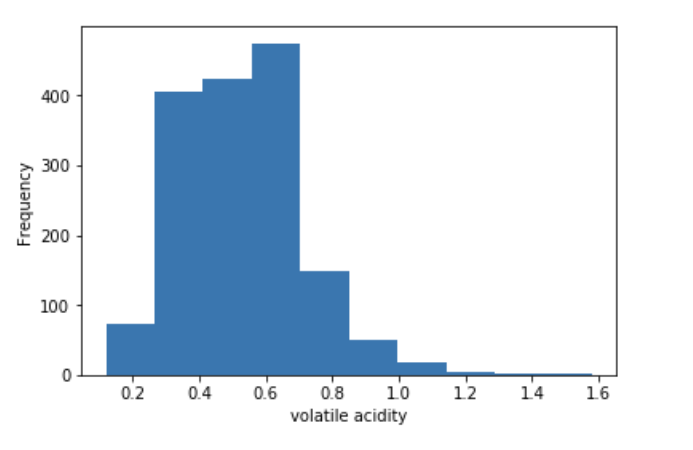
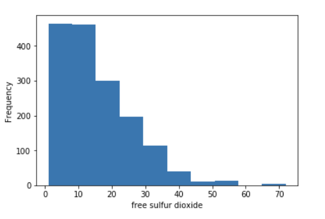
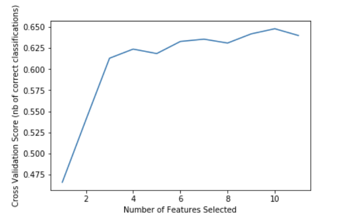
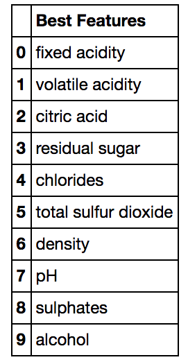

# Wine Quality Report

### Ying Dong, January 2018

## Introduction

This project is designed to explore the classification of red wine quality. It completes the analysis from downloading data to communicating the results of feature and model selection problem. 

The project is developed based on the [Wine Quality Data Set](http://archive.ics.uci.edu/ml/datasets/Wine+Quality) available from the UCI Machine Learning Repository, which contains 12 features and 1599 observations.

## Import the data

The dataset was imported by using the URL. There were 11 input variables based on physicochemical tests including `fixed acidity`, `volatile acidity`, `citric acid`, `residual sugar`,  `chlorides`,  `free sulfur dioxide`, `total sulfur dioxide`, `density`, `pH`, `sulphates` and  `alcohol`. There was also an output variable `quality` based on sensory data and classified into scores between 0 and 10.    
   
After getting a glimpse of all the features, the dataset was exported to the data directory of the project repository.

## Explore the data

The first thing I did was check whether any column contains missing values. Then I checked the distribution of each feature to find any strange range, which would have a negative influence on classification. Following figures are example distributions from features `volatile acidity` and `free sulfur dioxide`.

Then I cut my data into two sets, 30% for testing data, and 80% for training. All feature and model selections were conducted on the training data.

## Feature and model selection

During the process of feature and model selection, I fit three classification models, which are SVC, Random Forest and Decision Tree, together with a 5-fold cross-validation to find the best parameters for them. By comparison, the Random Forest model was selected with the lowest test error of 0.3375.

In addition, since I was not sure if all input variables were relevant, I decided to conduct a feature selection. I used RFECV to find the best subset of features. The following plot shows the number of features versus cross-validation scores. We can find that if the number of features equals to 10, the cross-validation score will be the highest. The RFECV model also provided a table which shows feature names of the optimal subset.   

   
   
Finally, I fit the Random Forest model again with the optimal subset of 10 features, and got a test error of 0.3167.

## Conclusion

As a result, the test error was reduced after feature and model selection. However, this result was still undesirable. The next step will be to conduct a further study on how each feature affects the response variable. 

